# Software-Savvy-Quiz
A short quiz to test your Software Development Knowledge on 3 different difficulty levels

The Objective of this site is to test users on their Software Knowledge through 3 different diffuclty levels
- Easy -For users with little Software Knowledge.
- Medium - For users with sufficient softare development knowledge.
- Hard - For users individuals who possess a significant amount of expertise in software development.

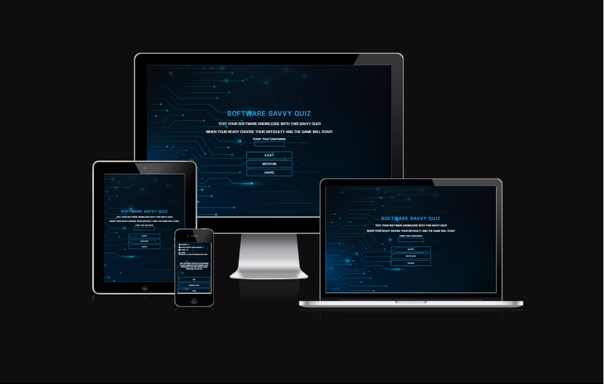

The Deployed Site is available [HERE](https://scottsmyth56.github.io/Software-Savvy-Quiz/)

## Table of Contents
+ [UX](#ux "UX")
  + [Site Goal](#site-goal "Site Goal")
  + [Audience](#audience "Audience")
  + [Current User Goals](#current-user-goals "Current User Goals")
  + [New User Goals](#new-user-goals "New User Goals")
+ [Design](#design "Design")
  + [Colour](#colour "Colour")
  + [Typography](#typography "Typography")
  + [Layout](#layout "Layout")
+ [Features](#features "Features")
  + [Current Features](#current-features "Current Features")
  + [Future Features](#future-features "Future Features")
+ [Testing](#testing "Testing")
  + [Lighthouse](#lighthouse "Lighthouse")
  + [HTML Validation](#html-validation "HTML Validation")
  + [CSS Validation](#css-validation "CSS Validation")
  + [Unfixed Bugs](#unfixed-bugs "Unfixed Bugs")
+ [Technologies Used](#technologies-used "Technologies Used")
  + [Languages Used](#languages-used "Languages Used")
  + [External Programs and Libraries Used](#external-programs-and-libraries-used "External Programs and Libraries Used")
+ [Deployment](#deployment "Deployment")
+ [Credit](#credit "Credit")
  + [Content](#content "Content")
  + [Media](#media "Media")
  
  
  
## UX
### Site Goal:
- Allow users to gain an understanding of their level of expertise on software development through an interactve quiz

### Audience:
This Site was mainly developed to attract an audience with an interest in Software Development.

### Current User Goals:
- Compete against friends competitively locally. 
- Test their level of expertise occasionally through new questions.

### New User Goals:
- Find the level of expertise in Software Development.

## Design

### Colour:

The aim of the colour scheme was to keep in line with the overall quiz theme being Software Development, After some Research i found Implementing  shades of blue and darker blue achieved a 
"Digital" feel to overall site enhancing user experience. The digital background image also pushes the more "Digital/Computer" theme to the user at first view.

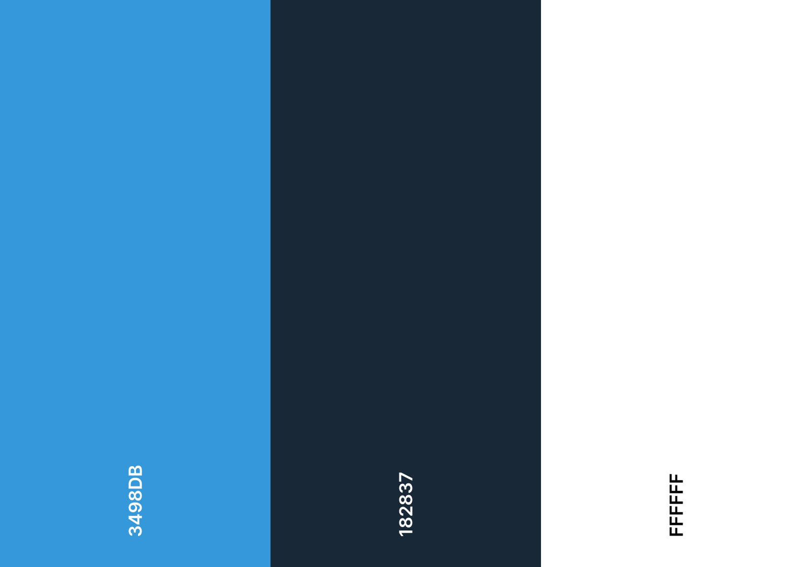

### Typography

The main typography used throughout the site was `Anybody`.This was chosen to further display the feeling of a digital theme but still be readable for the user. The font works well in all weights and looks professional throughout.

### Layout

The Layout for this site is simple and works perfectly for the overall goal of the site. Users can easily focus on the quiz game without taking time to navigating or trying to understand actions. 

The Wireframes for the site layout can be viewed below

#### Start Menu 

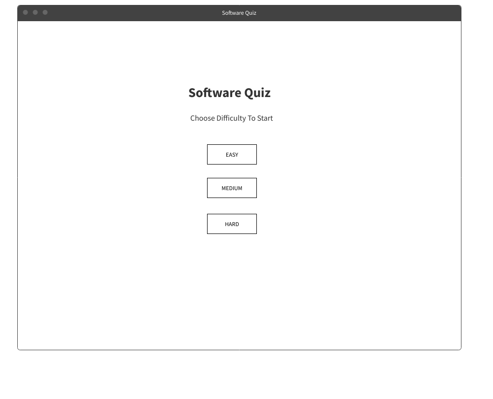

#### Gsme Scene 

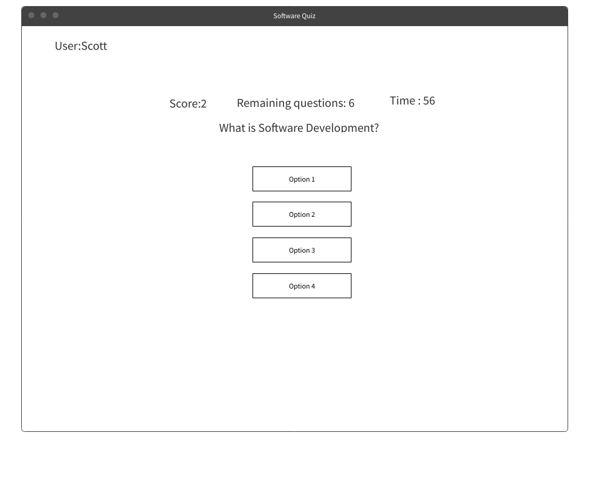

#### Results Scene

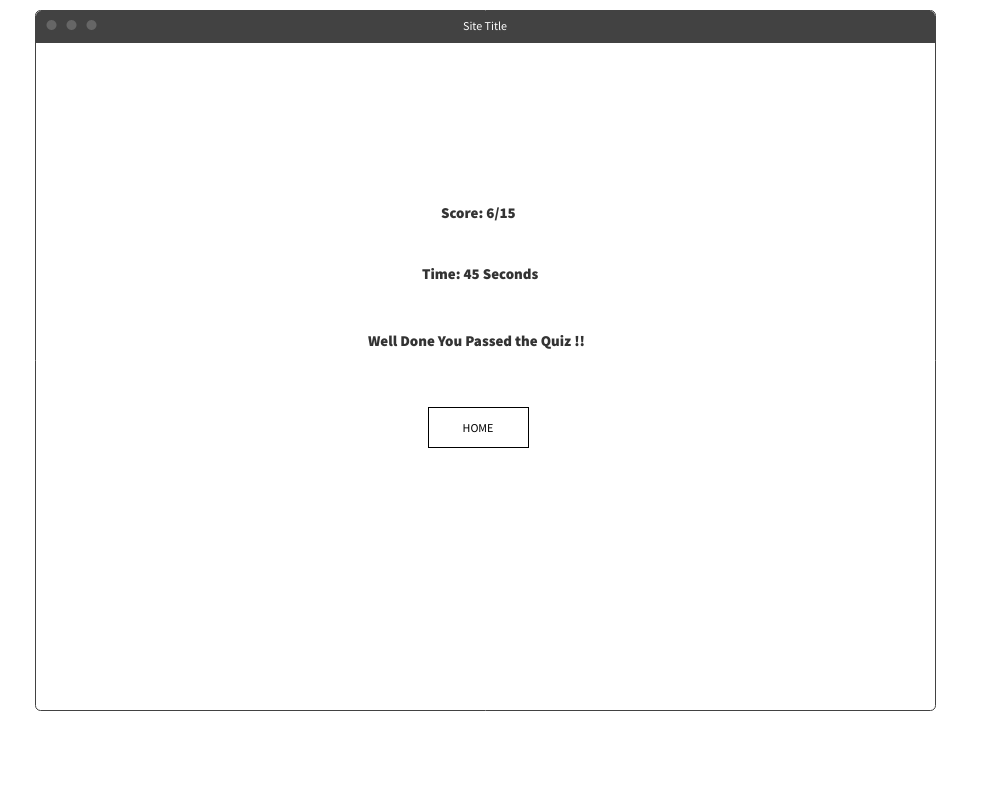

## Features 

### Current Features 

#### Game Start Menu

This is the landing page for the user before they start the quiz. Here the user is required to enter a username and choose a difficulty level before the game starts.

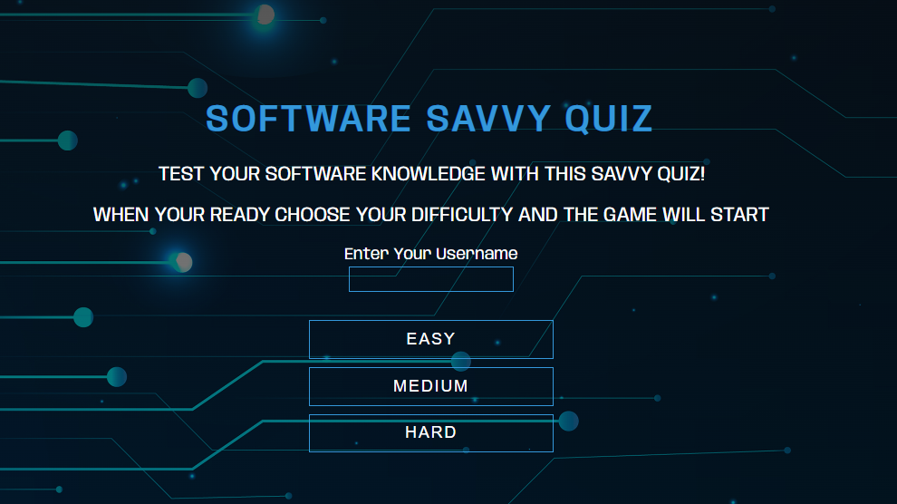

#### Game Information 

This block of information provides realtime information to the user as they play through the quiz. The Score will increment by one when a user answers a question correctly. The Questions Remaining information displays the amount of questions remaining. The Timer shows the current elapsed time from the start of the quiz.

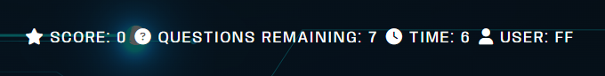

#### Quiz 

This is the primary feature in the site, Here a question is displayed to the user with a choice of 4 possible answers. A new question and new answers are prompted everytime a user chooses an option. 

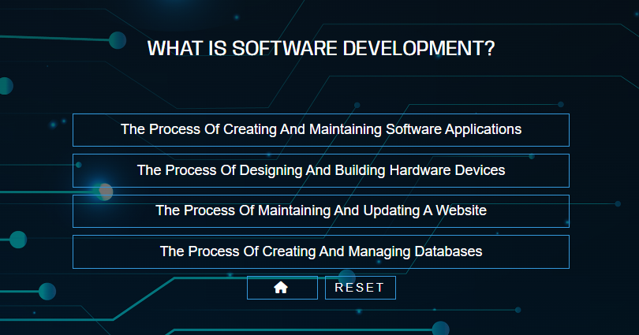

#### Results Scene

This is the final feature that is displayed to the user before starting the game again. Here the user's score and total time is displayed along with a message depicting whether the user passed the quiz or failed.

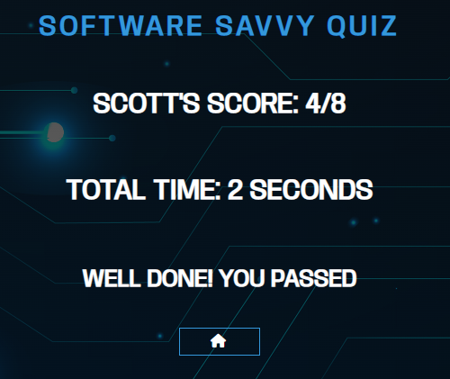

### Future Features

- Leaderboard.
- Invite Friends for Head to Head.
- Share Score on Social Media.
- Choose Different subjects based in Software Development.
- Hint Functionality.

## Testing

### Lighthouse 

As the Quiz was developed on one HTML page the site performed well in Lighthouse Testing.

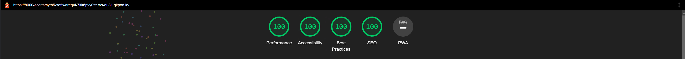

### HTML Validation

After Validating the HTML code throughout and making final changes. The HTML code has no issues throughout.

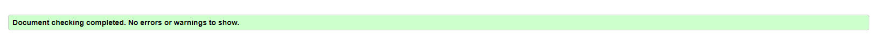

### CSS Validation

CSS passed validation with no errors.

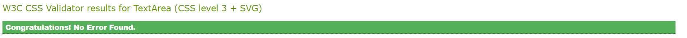

### Javascript Validation

This was currently my first time using JSHint so naturally some of the warnings it returned to me were unseen before by me. The code itself did not have many errors except missing a ` ; ` here and there. One Problem arose with the 'ESVersion' the current `ESVersion : 5` did not allow `For` `Let` `Const` as seen below.

#### NOTE : I Installed NodeJs and JShint Extension on VSCode Locally to test for errors in JS code instead of jshint online checker.

.png)

#### Solution 

I changed the config file in the jshint.options to use `ESVersion:6`. This cleared all of the problems.

.png)

#### Validated with no warnings or errors

.png)

### Unfixed Bugs
##### No Known Unfixed Bugs.

## Technologies Used

### Languages Used
- HTML5
- CSS3
- Javascript

### External Programs and Libraries Used
- Google Fonts - for the font family.
- Font Awesome - to add icons throughout the site.
- GitPod - to creat my html files & styling sheet before pushing the project to Github.
- GitHub - to store my repository for submission.
- Am I Responsive? - to ensure the project looked good across all devices.
- Favicon - to provide the code & image for the icon in the tab bar.
- MockFlow Wireframe - to create Wireframes for the site layout.

## Deployment
The site was deployed to GitHub pages. The steps to deploy are as follows:

- In the GitHub repository, navigate to the Settings tab
- From the source section drop-down menu, select the Master Branch
- Once the master branch has been selected, the page will be automatically refreshed with a detailed ribbon display to indicate the successful deployment.

### Cloning for Further Development(GitPod)

 - Open Gitpod
 - On the search bar, put the repository you want to clone https://github.com/scottsmyth56/Software-Savvy-Quiz.git and press Enter 
 - Gitpod will open the workspace, with the repository cloned and ready to use.
 - You can find your cloned repository on the left sidebar,
 - You can start working on the codebase, make changes and save them
 - When you are ready to push your changes, open the terminal and run git add . to add all the changes,
 - Commit your changes by running git commit -m "your commit message",
 - Push your changes by running git push.

### Cloning for Further Development ( Locally )
 - Make sure you have Git installed on your computer. If you don't have it already, you can download it from the official website (https://git-scm.com/)
 - Open a terminal window (on Windows, Git Bash is a good option)
 - Navigate to the directory where you want to clone the repository using the cd command. For example, to navigate to the Documents folder, you would use the command cd Documents.
- Use the following command to clone the repository: git clone https://github.com/scottsmyth56/Software-Savvy-Quiz.git
 - The command will create a new directory called "Software-Savvy-Quiz" in the current directory, and will copy all the files from the repository into that directory.
 - Navigate into the newly cloned directory by running cd Software-Savvy-Quiz.
 - you can check the content of the cloned repository by running ls command
 - Make sure to update your local copy with the remote repository by running git pull command
 - you can start to use the cloned repository as you wish

The Deployed Site is available [HERE](https://scottsmyth56.github.io/Software-Savvy-Quiz/)

## Credit 

### Content

- [Quiz Questions](https://www.sanfoundry.com/)
- [Quiz Questions](https://study.com/learn/software-development-quizzes.html)
- [Quiz Questions](https://quizizz.com/admin/quiz/5b8359ac6a2a990019c581e1/software-and-software-development)

### Media

### Imagery

- Background image sourced from  https://www.pexels.com/.

 Icons sourced from:
- https://icons8.com/
- https://fontawesome.com/

